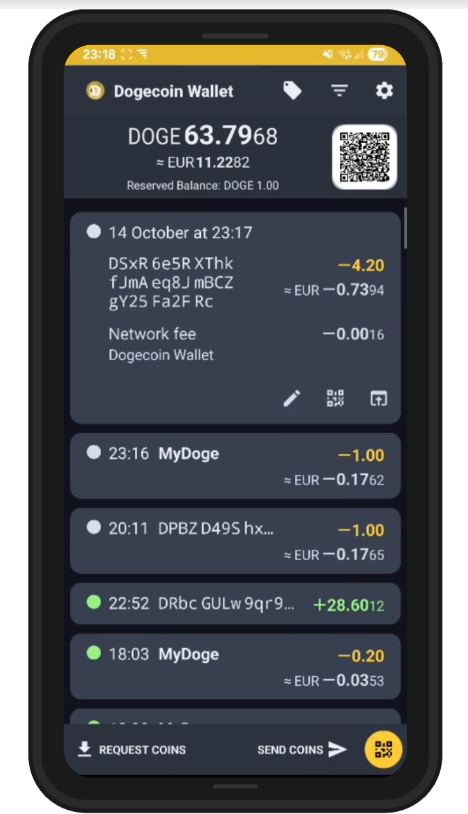
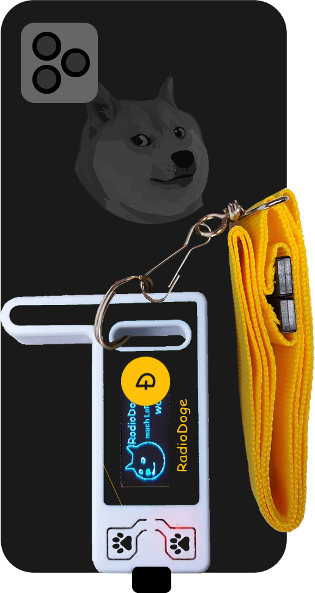

# DOGECOIN WALLET

Welcome to the reborn of the _Dogecoin Wallet_, a standalone, self-custodial Dogecoin payment wallet app for your Android device! This is a fork of the original Bitcoin Wallet, converted to support Dogecoin Blockchain.


## 📱 App Demo & RadioDoge Integration

<div style="display: flex; flex-wrap: wrap; gap: 20px; justify-content: center; align-items: center;">
  <div style="text-align: center;">
    <h4>Dogecoin Wallet App</h4>
    
  </div>
  <div style="text-align: center;">
    <h4>RadioDoge Integration</h4>
    
  </div>
</div>

### 🌐 More Information & Documentation
Visit **[dogecoinwallet.org](https://dogecoinwallet.org)** for comprehensive documentation, user guides, and the latest updates about the Dogecoin Wallet.

## 🚀 Latest Updates - Version 87

### 📱 New Features
- **Point of Sale (POS) System**: Complete e-commerce solution for merchants and businesses
  - **Product & Category Management**: Add products with categories, images, prices, descriptions, and inventory tracking
  - **Web-Based Storefront**: Access POS from any browser on your local network via local IP address
  - **QR Code Payments**: Generate unique payment addresses with QR codes for each product and quantity combination
  - **Real-Time Payment Detection**: Automatic payment monitoring with instant confirmation and automatic stock deduction
  - **Inventory Management**: Track quantities with automatic deduction on payment, unlimited stock option, and automatic hiding when quantity reaches 0
  - **Modern Web Interface**: Responsive design with dark theme, professional styling, and touch-friendly quantity selection with + and - buttons
  - **Category Filtering**: Filter products by category with intuitive icon-based interface
  - **Payment Success Animation**: Celebratory Dogecoin words animation on successful payments with automatic redirect to main page
  - **How It Works**: 
    1. Enable "Point of Sale Mode" in Settings → Configuration
    2. Access "Point of Sale Mode" menu from main wallet screen
    3. Add products with categories, images, prices, and quantities
    4. Access POS from any browser on your local network using the displayed IP address and port
    5. Customers browse products by category, select quantity, and scan QR code to pay
    6. Payment is automatically detected and inventory is updated in real-time
- **Digital Signature Improvements**: Enhanced user experience with modal-based interface
  - **Modal-Based UI**: Sign and verify signatures using modern modal dialogs instead of separate pages
  - **Streamlined Workflow**: Sign Text and Sign File options presented in a single modal with icons
  - **Better Organization**: View saved signatures list is now the first page when accessing Digital Signature feature
  - **Quick Actions**: Verify button on main list page for quick signature verification
  - **Improved UX**: More intuitive navigation with clear visual hierarchy and modern design
- **Settings Menu Reorganization**: Simplified and more intuitive menu structure
  - **Configuration Section**: Renamed "Settings" to "Configuration" within Settings menu for clarity
  - **Safety & Security Moved**: Safety notes, Technical notes, Backup wallet, Restore wallet, and Set spending PIN moved to main Settings menu
  - **Better Organization**: Settings menu now organized into logical sections:
    - **Configuration**: Wallet settings, preferences, and customization options
    - **Wallet Management**: Backup, restore, sweep paper wallet operations
    - **Information & Documentation**: Safety notes, technical notes, and help resources
    - **Advanced Tools**: Network monitoring, diagnostics, and reporting
  - **Simplified Navigation**: More intuitive menu structure makes it easier to find what you need
  - **Enhanced Descriptions**: Added detailed descriptions to help users understand each option
- **Menu Visibility Customization**: Control which menu items are visible in Settings → Configuration
  - **Family Mode Menu**: Show or hide the Family Mode menu option
  - **Recurring Payments Menu**: Show or hide the Recurring Payments menu option
  - **Digital Signature Menu**: Show or hide the Digital Signature menu option
  - **Default Visibility**: All menu items are visible by default for easy access
  - **Instant Updates**: Menu visibility changes take effect immediately
- **Comprehensive Translations**: Full internationalization support
  - **Point of Sale Translations**: All POS features translated to French, Spanish, Portuguese (Portugal & Brasil), and Chinese
  - **Digital Signature Translations**: All digital signature features translated to main languages
  - **Configuration Translations**: All settings and configuration options translated
  - **Complete Coverage**: All buttons, labels, and descriptions now available in supported languages

### 🔧 Technical Improvements
- **Background Sync Enhancement**: Implemented continuous mempool monitoring for receiving payments in background
- **Recurring Payments Background**: Enhanced background execution for scheduled payments
- **Service Optimization**: Improved BlockchainService and RecurringPaymentsService for better background operation
- **Battery Optimization**: Added requests to ignore battery optimizations for reliable background sync
- **Peer Connection Management**: Enhanced peer group management with automatic restart capabilities
- **Exchange Rate API**: Upgraded to direct DOGE-to-fiat exchange rates for improved accuracy and performance
  - **Direct API Calls**: Eliminates BTC conversion step for more accurate rates
  - **Global Currency Support**: Supports 100+ currencies worldwide
  - **Faster Updates**: Single API call fetches multiple currency rates simultaneously
- **Resource Shrinking**: Unused resources automatically removed from final build
- **ProGuard Optimization**: Enhanced code obfuscation and optimization

### 🐛 Bug Fixes
- **Biometric Authentication**: Fixed session persistence - no longer asks for authentication during internal navigation
- **Pay To Dropdown**: Fixed dropdown selection retention when editing recurring payments
- **Address Icon**: Updated QR code icon to wallet icon with proper white color for dark themes
- **Background Services**: Fixed service lifecycle management for better background operation
- **Memory Management**: Improved secure memory clearing for sensitive data
- **Widget Stability**: Better handling of widget state changes
- **Navigation Issues**: Fixed various navigation and state management bugs

### 🔒 Security Enhancements
- **Enhanced Biometric Security**: Session-based authentication that persists until app goes to background
- **Secure Memory Handling**: Better cleanup of sensitive data
- **Improved Key Management**: Enhanced security for wallet operations
- **Authentication Flow**: More reliable biometric authentication with proper lifecycle management
- **Background Security**: Secure background transaction processing and broadcasting

This project contains several sub-projects:

 * __wallet__:
     The Android app itself. This is probably what you're searching for.
 * __market__:
     App description and promo material for the Google Play app store.
 * __integration-android__:
     A tiny library for integrating Dogecoin payments into your own Android app
     (e.g. donations, in-app purchases).
 * __sample-integration-android__:
     A minimal example app to demonstrate integration of Dogecoin payments into
     your Android app.

## 📋 VERSION HISTORY

### Version 87 - UI Simplification, Translations & Bug Fixes
- **Settings Menu Reorganization**: Simplified and more intuitive menu structure
  - Renamed "Settings" to "Configuration" within Settings menu for clarity
  - Moved Safety notes, Technical notes, Backup wallet, Restore wallet, and Set spending PIN to main Settings menu
  - Better organization with logical sections: Configuration, Wallet Management, Information & Documentation, Advanced Tools
  - Enhanced descriptions to help users understand each option
- **Digital Signature UI Improvements**: Enhanced user experience with modal-based interface
  - Sign and verify signatures using modern modal dialogs instead of separate pages
  - Streamlined workflow with Sign Text and Sign File options in a single modal
  - View saved signatures list is now the first page when accessing Digital Signature
  - Quick Verify button on main list page for quick signature verification
  - Improved UX with clear visual hierarchy and modern design
- **Comprehensive Translations**: Full internationalization support
  - All Point of Sale features translated to French, Spanish, Portuguese (Portugal & Brasil), and Chinese
  - All Digital Signature features translated to main languages
  - All Configuration and Settings options translated
  - Complete coverage of all buttons, labels, and descriptions
- **Crash Fixes**: Resolved critical stability issues
  - Fixed BlockStoreException crashes during service shutdown
  - Fixed OutOfMemoryError by improving memory management during low memory conditions
  - Enhanced service lifecycle management with proper shutdown procedures
  - Better resource cleanup during app destruction and memory pressure

### Version 86 - Point of Sale System & Menu Customization
- **Point of Sale (POS) System**: Complete e-commerce solution for merchants and businesses
  - Product and category management with images, prices, and inventory tracking
  - Web-based storefront accessible from any browser on local network
  - QR code payment generation with unique addresses per product/quantity
  - Real-time payment detection with automatic stock management
  - Modern responsive web interface with dark theme
- **Menu Visibility Settings**: Added settings to control visibility of Family Mode, Recurring Payments, and Digital Signature menu items
- **User Control**: Users can now hide menu items they don't use to customize their wallet interface
- **Default Visibility**: All menu items are visible by default for easy access
- **Instant Updates**: Menu visibility changes take effect immediately when menu is displayed
- **Settings Integration**: New preferences available in Settings → Settings for menu customization

### Version 85 - UI Duplication Fix & Minification
- **Fragment Duplicate Prevention**: Enhanced fragment management to prevent UI layer duplication
- **Activity Lifecycle**: Improved activity state management to prevent double UI elements
- **ProGuard Minification**: Enabled minification and resource shrinking for optimized app size
- **Background State**: Simplified background tracking to prevent UI conflicts

### Version 83 - DogeConnect & Payment Terminal Mode
- **DogeConnect Integration**: Fully integrated Dogecoin Foundation connect.dogecoin.org connect protocol for secure wallet connections
- **Payment Terminal Mode**: PIN-protected secure payment terminal for POS systems with kiosk mode
- **Background Execution**: Enhanced recurring payments with foreground service support for Android 15+ compatibility
- **Permissions**: Added Android 15+ permissions for better background execution
- **Terminal Mode Exit**: Secure PIN-based exit with automatic mode disabling when exiting

### Version 79-82 - Terminal Mode Development
- **Payment Terminal**: Initial implementation of secure payment terminal for POS systems with kiosk mode
- **PIN Protection**: PIN-based exit from terminal mode with automatic mode disabling
- **Lifecycle Management**: Enhanced activity lifecycle to prevent bypassing terminal mode

## ✨ NEW FEATURES & IMPROVEMENTS

### 🔍 Advanced QR Code Scanner
- **Upgraded to Google ML Kit**: Replaced ZXing with Google ML Kit Barcode Scanning for superior QR code detection
- **Modern QR Code Support**: Can read aesthetic QR codes with bullet points, custom shapes, and non-standard designs
- **Better Accuracy**: Machine learning-based detection provides higher success rates
- **Compatibility**: Maintains support for traditional square QR codes

### 🌐 Worldwide Node Discovery
- **New Total Nodes Tab**: Added comprehensive network monitoring in the Network Monitor
- **Real-time Discovery**: Continuously discovers Dogecoin nodes worldwide every 5 seconds
- **Detailed Information**: Shows node version, sub-version, services, synced blocks, and connection status
- **Health Monitoring**: Automatically removes inactive nodes and finds replacements every 10 minutes
- **IPv6 & TOR Support**: Discovers nodes across different network types
- **Live Updates**: Real-time display of discovered nodes with progress indicators

### 📚 Education Section
- **Comprehensive Learning**: Complete guides covering Dogecoin, blockchain technology, and wallet features
- **RadioDoge Information**: Detailed explanation of offline transaction capabilities using radio waves
- **Dogecoin Philosophy**: Educational content about empowering unbanked people worldwide
- **Family-Friendly**: Designed for both adults and children to learn about cryptocurrency
- **Multilingual Support**: Available in English, Spanish, and French
- **Interactive Learning**: Expandable sections with detailed explanations and practical tips

### 📝 Digital Document Signing
- **Document & Message Signing**: Sign any text, document, or message with your Dogecoin private key
- **File Hash Generation**: Automatically generates SHA256 hash for file verification
- **Camera Integration**: Take photos and sign them directly from the camera
- **Easy Sharing**: Share signed documents and signatures via any Android sharing method
- **Signature Verification**: Verify signatures against original text or file hashes
- **Secure Storage**: Signed photos are stored in a dedicated "signed" folder
- **Multiple Formats**: Support for text messages, file hashes, and photo signatures

### 💳 Recurring Payments & Scheduled Transactions
- **One-Time & Recurring Payments**: Schedule payments for specific dates or recurring monthly
- **Precise Scheduling**: Set exact date and time for payment execution
- **Reference Field**: Add custom reference data (OP_RETURN) for bill payments, client IDs, or service identification
- **Address Book Integration**: Select from existing addresses or add new labeled addresses
- **Background Execution**: Automatic payment processing via background service
- **Enable/Disable Control**: Toggle recurring payments on/off as needed
- **Edit & Manage**: Full CRUD operations for scheduled payments
- **Blockchain Storage**: Reference data is permanently stored on the Dogecoin blockchain
- **Real-Time Monitoring**: Live status updates and payment history

### 👨‍👩‍👧‍👦 Family Mode & Child Wallet Management
- **Child Wallet Creation**: Generate unique derived keys for family members with individual addresses
- **QR Code Sharing**: Share child wallet access via QR codes for easy device setup
- **PIN Protection**: Secure access to sensitive features (Safety, Family Mode, Settings) with PIN authentication
- **Child Mode Activation**: Import child wallet keys to restrict device to single address operation
- **Address Management**: Each child gets their own Dogecoin address with individual balance tracking
- **Transaction Monitoring**: Real-time monitoring of child wallet transactions and balance updates
- **Parental Controls**: Parents can send coins to children and monitor their spending
- **Secure Key Management**: HD wallet key derivation ensures unique addresses for each family member
- **Easy Restoration**: Children can restore their wallet on any device using the shared QR code
- **Balance Tracking**: Individual balance display for each family member's address
- **Edit & Manage**: Full management of family members including name editing and wallet operations

### 🔒 Address Exclusion & Spending Control
- **Smart Address Management**: Exclude specific addresses from being used in regular payments
- **Family Mode Integration**: Child addresses are automatically excluded from spending to protect their funds
- **Reserved Balance Display**: Main wallet shows total reserved balance from excluded addresses
- **Manual Control**: Toggle exclusion on/off for any address in "Your Addresses" tab
- **Visual Indicators**: Clear badges and labels show which addresses are excluded from spending
- **Balance Protection**: Prevents accidental spending of child's coins in daily transactions
- **Parental Safety**: Ensures child funds remain separate and protected from parent's regular spending
- **Modern UI**: Clean, intuitive interface with toggle switches and status indicators
- **Real-time Updates**: Balance calculations automatically exclude reserved funds

### 🛒 Point of Sale (POS) System
- **Full E-Commerce Solution**: Complete point of sale system for merchants and businesses
- **Product Management**: Add, edit, and delete products with categories, descriptions, prices, and images
- **Category Organization**: Organize products into categories for easy browsing and management
- **Product Images**: Add product images via camera or gallery with automatic resizing
- **Inventory Management**: Track product quantities with automatic deduction on payment
- **Unlimited Stock Option**: Set products to unlimited stock for services or digital goods
- **Local Web Interface**: Access your POS from any browser on the same network via local IP address
- **Online Storefront**: Beautiful web interface displaying products by category with product details
- **QR Code Payments**: Generate unique payment addresses with QR codes for each product and quantity
- **Real-Time Payment Detection**: Automatic payment monitoring with instant confirmation
- **Payment Success Animation**: Celebratory Dogecoin words animation on successful payments
- **Automatic Redirect**: Redirects to main page after 5 seconds on successful payment
- **Quantity Selection**: Touch-friendly + and - buttons for quantity selection on web interface
- **Mobile Responsive**: Fully responsive design that works on desktop, tablet, and mobile browsers
- **Modern UI**: Dark theme matching Dogecoin Wallet design with professional styling
- **Category Filtering**: Filter products by category with intuitive icon-based interface
- **Stock Visibility**: Products with 0 quantity are automatically hidden from display
- **Unlimited Display**: Products with unlimited stock show "Unlimited" on the web interface

### ⚙️ Menu Customization & Visibility Control
- **Menu Visibility Settings**: Control which menu items are visible from Settings → Settings
- **Family Mode Menu**: Show or hide the Family Mode menu option based on your preferences
- **Recurring Payments Menu**: Show or hide the Recurring Payments menu option
- **Digital Signature Menu**: Show or hide the Digital Signature menu option
- **Default Visibility**: All menu items are visible by default for easy access
- **Instant Updates**: Menu visibility changes take effect immediately when menu is displayed
- **Personalized Interface**: Customize your wallet menu to show only the features you use
- **User-Friendly Settings**: Easy-to-use checkboxes in Settings for quick menu customization

### 📊 Accounting Reports & Transaction Analytics
- **Comprehensive Transaction Reports**: Generate detailed reports of all wallet transactions with full data export
- **Multiple Export Formats**: Export to CSV, JSON, or PDF with professional formatting
- **Date Range Selection**: Filter transactions by custom date ranges for specific reporting periods
- **Visual Timeline Charts**: Modern interactive charts showing transaction flow over time
- **Detailed Transaction Data**: Complete transaction information including:
  - Transaction ID (full, non-truncated)
  - Transaction type (Send, Receive, Internal)
  - Timestamps with full UTC formatting
  - Source and destination addresses with labels
  - Amounts and fees with 8 decimal precision
  - OP_RETURN notes and transaction metadata
- **Professional PDF Reports**: Landscape-formatted reports with Dogecoin branding, pagination, and modern styling
- **Smart Transaction Classification**: Automatic detection of internal transactions and proper fee handling
- **Net Amount Calculation**: Send transactions show net amount (amount - fee) for accurate reporting
- **Share Integration**: Easy sharing of reports via any Android sharing method
- **Real-time Data**: Live transaction data with automatic updates
- **Export Summary**: Total amounts received, sent, and fees paid for comprehensive financial overview

## 📱 FEATURES

• **Decentralized**: No registration, web service or cloud needed! This wallet is peer-to-peer.
• **Multi-Unit Display**: Display of Dogecoin amount in DOGE, mDOGE and µDOGE.
• **Currency Conversion**: Real-time conversion to and from national currencies.
• **Multiple Payment Methods**: Send and receive Dogecoin via NFC, QR codes, or Dogecoin URLs.
• **Offline Payments**: When you're offline, you can still pay via Bluetooth.
• **Notifications**: System notification for received coins.
• **Paper Wallet Support**: Sweeping of paper wallets (e.g. those used for cold storage).
• **Android Widget**: Home screen widget to easily view your Dogecoin balance and quickly access send/receive functions without opening the app.
• **Low Fees**: Uses official Dogecoin fee recommendations (0.01 DOGE per KB) for affordable transactions.
• **Security**: Supports SegWit and modern address formats.
• **Privacy**: Supports Tor via the separate Orbot app.

### 🆕 NEW ADVANCED FEATURES

• **🛒 Point of Sale (POS) System**: Complete e-commerce solution for merchants with product management, web-based storefront, QR code payments, and real-time inventory tracking.
• **📝 Digital Document Signing**: Sign any text, document, or photo with your Dogecoin private key for authentication and verification.
• **💳 Recurring Payments**: Schedule one-time or monthly recurring payments with precise date/time control.
• **👨‍👩‍👧‍👦 Family Mode**: Create and manage child wallets with individual addresses, PIN protection, and parental controls.
• **🏷️ Reference Data**: Add custom reference information (OP_RETURN) to payments for bill identification, client IDs, or service tracking.
• **📸 Camera Integration**: Take photos and sign them directly from the camera for document authentication.
• **🔄 Background Processing**: Automatic execution of scheduled payments via background service.
• **📋 Address Management**: Integrated address book for easy payment destination selection.
• **✅ Signature Verification**: Verify document signatures against original content for authenticity.
• **🌐 Blockchain Storage**: Reference data is permanently stored on the Dogecoin blockchain for decentralized verification.
• **🔐 Child Wallet Security**: HD key derivation and QR code sharing for secure family wallet management.
• **🔒 Address Exclusion Control**: Exclude specific addresses from spending to protect child funds and manage reserved balances.
• **📡 RadioDoge Integration**: Send signed Dogecoin transactions without internet using LoRa technology! Connect with KeyChain LoRa or any LoRa-enabled device for offline transactions. Powered by [RadioDoge V3 from Dogecoin Foundation](https://github.com/dogecoinfoundation/radiodoge).

### 📡 RadioDoge - Offline Dogecoin Transactions

RadioDoge is a revolutionary feature that enables Dogecoin transactions without internet connectivity using LoRa (Long Range) radio technology. This makes the wallet perfect for remote areas, emergency situations, or any scenario where internet access is limited or unavailable.

#### Key Features:
- **🌐 No Internet Required**: Send transactions completely offline using LoRa radio waves
- **📡 LoRa Technology**: Long-range, low-power radio communication (up to 10+ km range)
- **🔒 Secure Broadcasting**: Transactions are signed locally and broadcast via RadioDoge devices
- **⚡ Automatic Detection**: Automatically detects RadioDoge WiFi network and switches to offline mode
- **🔄 Smart Fallback**: Falls back to normal internet broadcasting when connectivity is available
- **⚙️ Configurable**: Enable/disable RadioDoge functionality in app settings
- **🌍 Global Reach**: Works with any LoRa-enabled device, not just specific hardware

#### How It Works:
1. **Connect to RadioDoge**: Connect to "RadioDoge" WiFi network from a LoRa device
2. **Create Transaction**: Send Dogecoin as normal - the wallet detects the offline environment
3. **Automatic Broadcasting**: Transaction is automatically broadcast via RadioDoge instead of internet
4. **Global Propagation**: RadioDoge devices relay the transaction to the broader network

#### Compatible Devices:
- **KeyChain LoRa**: Official RadioDoge hardware from Dogecoin Foundation
- **Custom LoRa Devices**: Any LoRa-enabled device running RadioDoge V3 software
- **Community Networks**: Connect to existing RadioDoge mesh networks

This feature is powered by the [RadioDoge V3 project](https://github.com/dogecoinfoundation/radiodoge) from the Dogecoin Foundation, ensuring compatibility and ongoing development support.

## 📱 Platform Support

### Android
- **Current Version**: v1.0 (Version Code: 86)
- **Target SDK**: API 35 (Android 15)
- **Minimum SDK**: API 24 (Android 7.0)
- **Status**: Available now on Google Play Store
- **Features**: Full feature set including RadioDoge, Family Mode, Background Sync, and all advanced features
- **Build Size**: ~14.3 MB (minified AAB)
- **Android 15 Compatible**: ✅ Fixed BOOT_COMPLETED foreground service restrictions

### iOS
- **Coming Soon**: iOS version currently in development
- **Expected Features**: Full feature parity with Android version
- **Timeline**: Expected release in Q2 2025
- **Updates**: Follow our GitHub repository for development progress

## 💰 TRANSACTION FEES

This wallet follows the official Dogecoin fee recommendations for optimal network performance and user experience:

### **Fee Structure**
- **All Categories**: 0.01 DOGE per kilobyte (KB) of transaction data
- **Fee Categories**: ECONOMIC, NORMAL, and PRIORITY all use the same rate
- **Static Fees**: No dynamic fee fetching - uses consistent, predictable fees

### **Real-World Examples**
- **Small transaction** (~250 bytes): ~0.0025 DOGE
- **Medium transaction** (~500 bytes): ~0.005 DOGE  
- **Large transaction** (~1000 bytes): ~0.01 DOGE

### **Benefits**
- **Affordable**: Much lower than Bitcoin fees, making micro-transactions practical
- **Predictable**: Same fee rate across all transaction types
- **Official Standards**: Follows [Dogecoin Core recommendations](https://github.com/dogecoin/dogecoin/blob/master/doc/fee-recommendation.md)

## 🛠️ PREREQUISITES FOR BUILDING

### System Requirements
- **Operating System**: Windows 10/11, macOS, or Linux
- **Java**: Java 8 SDK or later (OpenJDK recommended)
- **Android Studio**: Version 2023.1.1 or later
- **Android SDK**: API Level 35 (Android 15) - Required for Google Play Console
- **Build Tools**: 35.0.0 or later
- **Gradle**: 8.12.2 (included with Android Studio)

### Required Tools
- Git (for version control)
- Android Studio (for development and building)
- Android SDK Tools
- Java Development Kit (JDK 8 or later)

## 🏗️ BUILDING THE DOGECOIN WALLET

### Quick Build Commands

#### **Build Android App Bundle (AAB) for Google Play Console**:
```bash
# Clean previous builds
.\gradlew clean

# Build release AAB
.\gradlew :wallet:bundleRelease
```

#### **Build APK for Testing**:
```bash
# Build debug APK
.\gradlew :wallet:assembleDebug

# Build release APK
.\gradlew :wallet:assembleRelease
```

### 📦 Build Outputs

After building, you'll find:
- **AAB File**: `wallet/build/outputs/bundle/release/wallet-release.aab`
- **APK Files**: `wallet/build/outputs/apk/release/` or `debug/`
- **R8 Mapping**: `wallet/build/outputs/mapping/release/mapping.txt`

### 🏗️ BUILDING WITH ANDROID STUDIO

### 1. Initial Setup

1. **Clone the repository**:
   ```bash
   git clone https://github.com/qlpqlp/dogecoin-wallet.git
   cd dogecoin-wallet
   ```

2. **Open in Android Studio**:
   - Launch Android Studio
   - Select "Open an existing Android Studio project"
   - Navigate to the cloned repository folder
   - Click "OK"

3. **Configure Android SDK**:
   - Go to `File` → `Project Structure` → `SDK Location`
   - Ensure Android SDK is properly configured
   - Verify that API Level 35 is installed

### 2. Project Configuration

1. **Sync Project**:
   - Android Studio will automatically detect the Gradle project
   - Click "Sync Now" when prompted
   - Wait for the sync to complete

2. **Configure Signing** (for release builds):
   - Go to `Build` → `Generate Signed Bundle/APK`
   - Create a new keystore or use existing one
   - Configure signing for release builds

### 3. Building the Application

#### Debug Build
1. **Select Build Variant**:
   - In Android Studio, go to `Build` → `Select Build Variant`
   - Choose `debug` variant

2. **Build APK**:
   - Go to `Build` → `Build Bundle(s) / APK(s)` → `Build APK(s)`
   - Wait for build to complete
   - APK will be generated in `wallet/build/outputs/apk/debug/`

#### Release Build
1. **Select Build Variant**:
   - Choose `release` variant from Build Variants panel

2. **Generate Signed APK**:
   - Go to `Build` → `Generate Signed Bundle/APK`
   - Select APK and click Next
   - Choose your keystore and configure signing
   - Click Finish

### 4. Running on Device/Emulator

1. **Connect Device**:
   - Enable Developer Options on your Android device
   - Enable USB Debugging
   - Connect device via USB

2. **Run Application**:
   - Click the "Run" button (green play icon) in Android Studio
   - Select your connected device or emulator
   - The app will be installed and launched

### 5. Google Play Console Requirements

#### **For Production Release**:
- **Target SDK**: API 35 (Android 15) ✅
- **Version Code**: Must be unique and incrementing ✅
- **R8 Mapping**: Upload `mapping.txt` for crash analysis ✅
- **App Bundle**: Use AAB format (not APK) ✅
- **Signing**: Must be signed with release keystore ✅

#### **Current Build Configuration**:
- **Version Name**: 1.0
- **Version Code**: 86
- **Target SDK**: 35
- **Minify**: Enabled (R8)
- **Signing**: Release keystore configured
- **Android 15 Fix**: BOOT_COMPLETED restrictions resolved
- **Background Services**: Enhanced for mempool monitoring and recurring payments

### 6. Troubleshooting Common Issues

#### Build Errors
- **Gradle Sync Issues**: Clean and rebuild project (`Build` → `Clean Project`, then `Build` → `Rebuild Project`)
- **SDK Issues**: Ensure Android SDK is properly installed and configured
- **Dependency Issues**: Check that all dependencies are properly resolved

#### Runtime Issues
- **Permission Issues**: Ensure all required permissions are granted
- **Network Issues**: Check internet connectivity for blockchain sync
- **Storage Issues**: Ensure sufficient storage space for blockchain data

## 🔧 ADVANCED BUILD CONFIGURATION

### Gradle Properties
The project uses the following key Gradle properties:
```properties
org.gradle.jvmargs=-Xmx4096M
android.useAndroidX=true
android.enableJetifier=true
android.suppressUnsupportedCompileSdk=34
android.nonTransitiveRClass=false
android.defaults.buildfeatures.buildconfig=true
android.nonFinalResIds=false
android.enableR8.fullMode=false
```

### Build Variants
- **Debug**: Development build with debugging enabled
- **Release**: Production build optimized for distribution

### Dependencies
Key dependencies include:
- `libdohj:0.15` - DogecoinJ library
- `androidx.*` - AndroidX libraries
- `com.google.mlkit:barcode-scanning:17.2.0` - Advanced QR code scanning with ML Kit
- `com.google.zxing:core:3.5.3` - Legacy QR code support (kept for compatibility)
- `com.squareup.okhttp3:okhttp:3.14.9` - HTTP client

## 📦 DISTRIBUTION

### APK Signing
For distribution, you must sign your APK:
1. Generate a keystore file
2. Configure signing in `build.gradle`
3. Build signed APK for distribution

### Google Play Store
To publish on Google Play:
1. Create a Google Play Console account
2. Prepare store listing materials
3. Upload signed APK or AAB
4. Complete store listing and publish

## 👥 DEVELOPMENT TEAM & CONTRIBUTIONS

### Lead Developer & Security Architect
- **Paulo Vidal** - [x.com/inevitable360](https://x.com/inevitable360) (Dogecoin Foundation)
  - Complete Bitcoin to Dogecoin conversion
  - Advanced security implementations (secure memory clearing, enhanced PBKDF2)
  - Biometric authentication system for widgets and shortcuts
  - Family Mode and child wallet management
  - Digital signature functionality
  - Accounting reports and transaction analytics
  - Website development and modern UI improvements
  - Crash fixes and stability improvements
  - Android 15 compatibility and Google Play compliance

### Original Bitcoin Wallet Authors
- **Andreas Schildbach** - Original Bitcoin Wallet creator
- **jim** - Core cryptographic implementations

### Key Contributions
- **Security Enhancements**: Comprehensive secure memory clearing, PBKDF2 improvements, biometric protection
- **Feature Development**: Family Mode, digital signatures, accounting reports, recurring payments
- **UI/UX Improvements**: Modern dark theme website, interactive animations, responsive design
- **Platform Compatibility**: Android 15 support, Google Play compliance, modern Android features
- **Code Quality**: Extensive author attribution across 113+ files, comprehensive documentation, security reviews
- **Crash Fixes**: Resolved NullPointerException crashes in AlertDialogsFragment and other components
- **Build Optimization**: R8 minification, mapping file generation, APK/AAB optimization
- **Documentation**: Complete README updates, comprehensive feature documentation

## 🤝 CONTRIBUTING

This project is open source and welcomes contributions:

1. Fork the repository
2. Create a feature branch
3. Make your changes
4. Test thoroughly
5. Submit a pull request

## 📄 LICENSE

This project is licensed under the GNU General Public License v3.0 (GPLv3).
See the [LICENSE](LICENSE) file for details.

## ⚠️ DISCLAIMER

**Use at your own risk!** This software is provided as-is without any warranty. 
Always backup your wallet and test with small amounts before using for significant transactions.

## 📞 SUPPORT

For issues and support:
- **Email**: report@dogecoinwallet.org
- **GitHub Issues**: [Create an issue](https://github.com/qlpqlp/dogecoin-wallet/issues)
- **Documentation**: Check the [wiki](https://github.com/qlpqlp/dogecoin-wallet/wiki)

## 🙏 CREDITS

- **Original Bitcoin Wallet**: Andreas Schildbach
- **Dogecoin Wallet Conversion**: Langer Hans [@langer_hans](https://x.com/langer_hans)
- **Additional Contributors**: Paulo Vidal (Dogecoin Foundation Developer) and other contributors
- **DogecoinJ Library**: [libdohj](https://github.com/dogecoin/libdohj)
- **Google ML Kit**: Advanced QR code scanning with machine learning
- **ZXing**: Legacy QR code scanning library (kept for compatibility)
- **AndroidX**: Modern Android libraries
- **OkHttp**: HTTP client library

---

**Hope you like it. Happy Dogecoin transactions!**