# DOGECOIN WALLET

Welcome to the reborn of the _Dogecoin Wallet_, a standalone, self-custodial Dogecoin payment wallet app for your Android device! This is a fork of the original Bitcoin Wallet, converted to support Dogecoin Blockchain.


## Screenshots

<div style="display: flex; flex-wrap: wrap; gap: 10px;">
  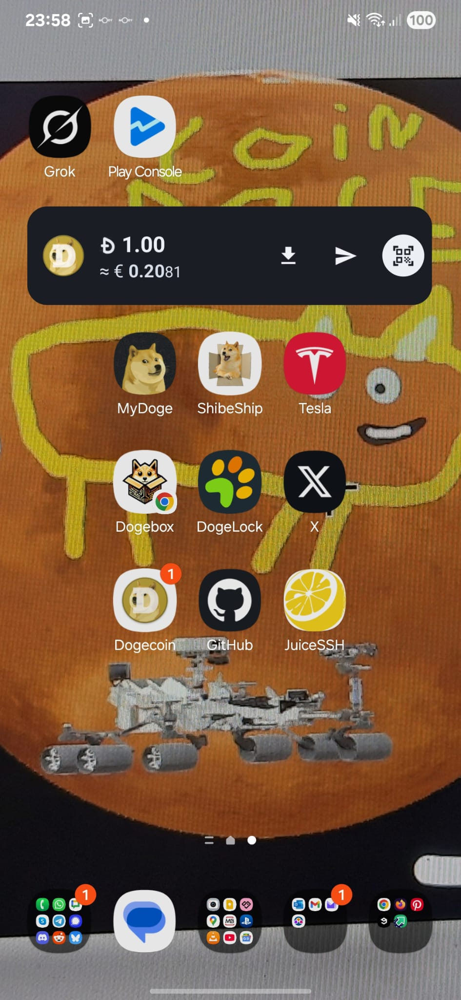
  
  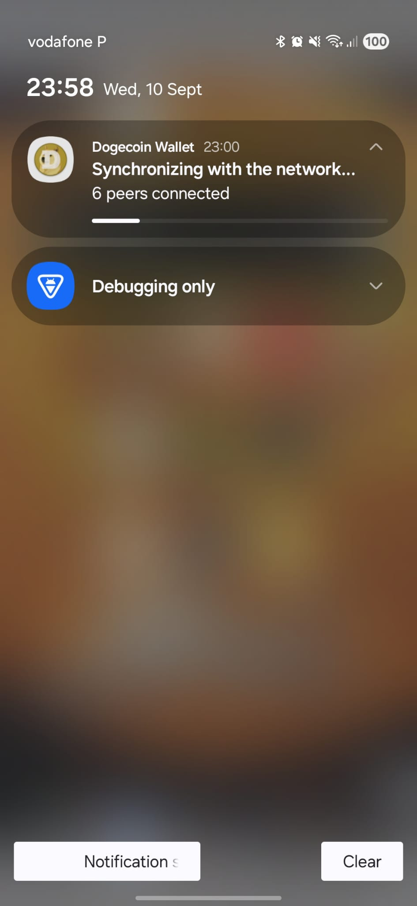
  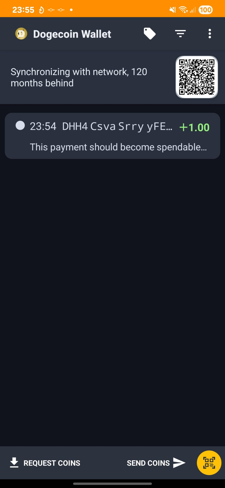
  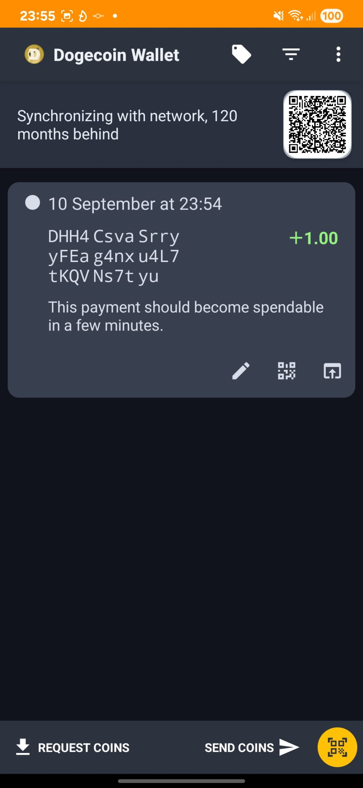
  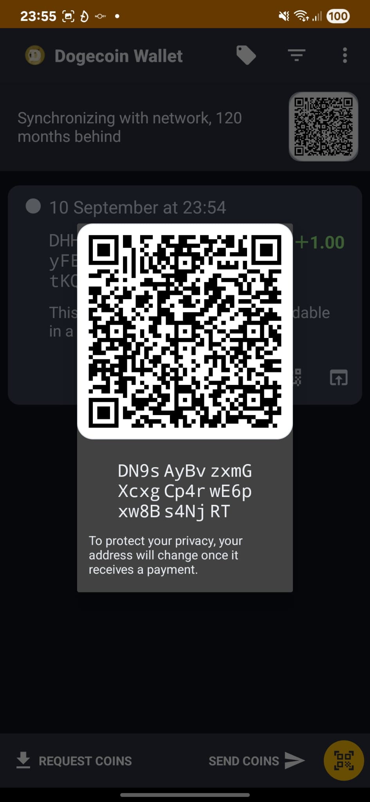
  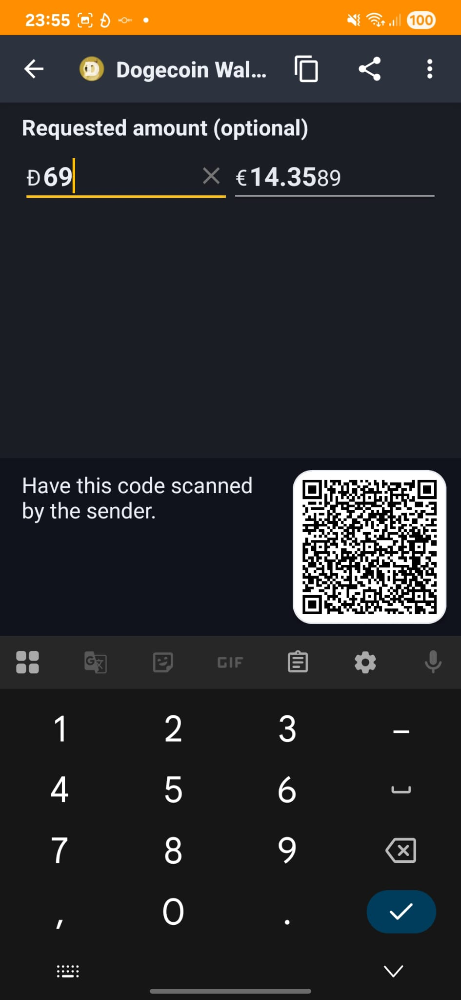
  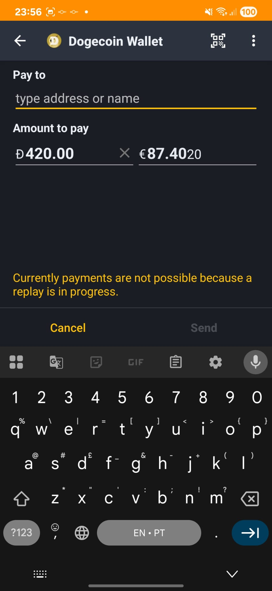
  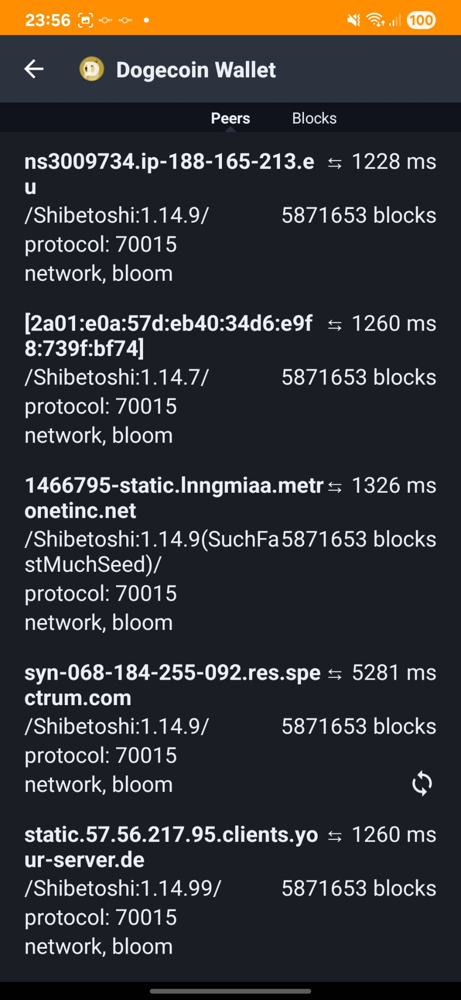
  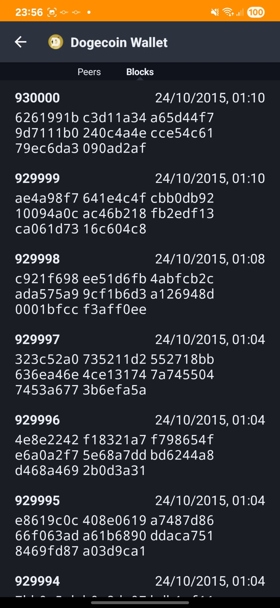
  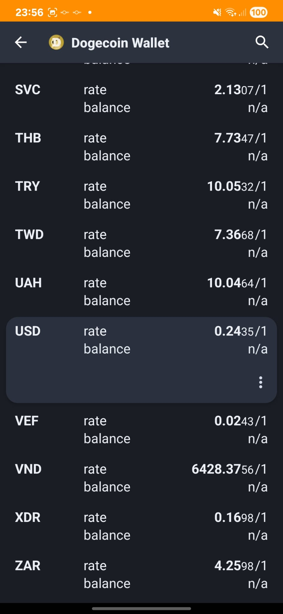
  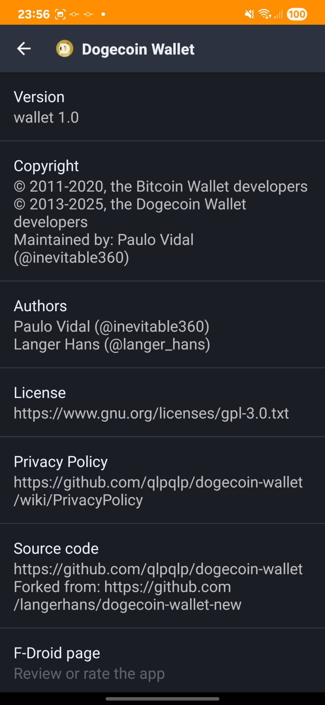
  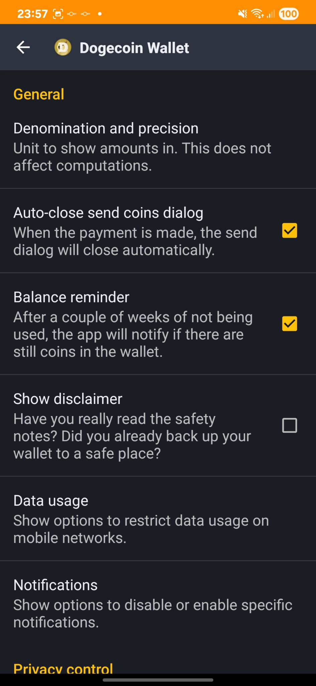
  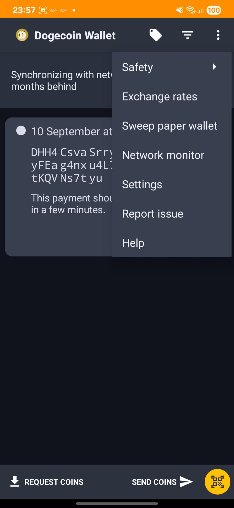
  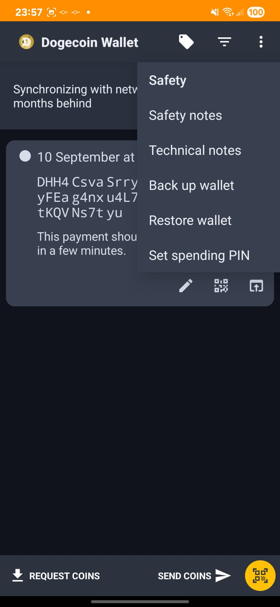
  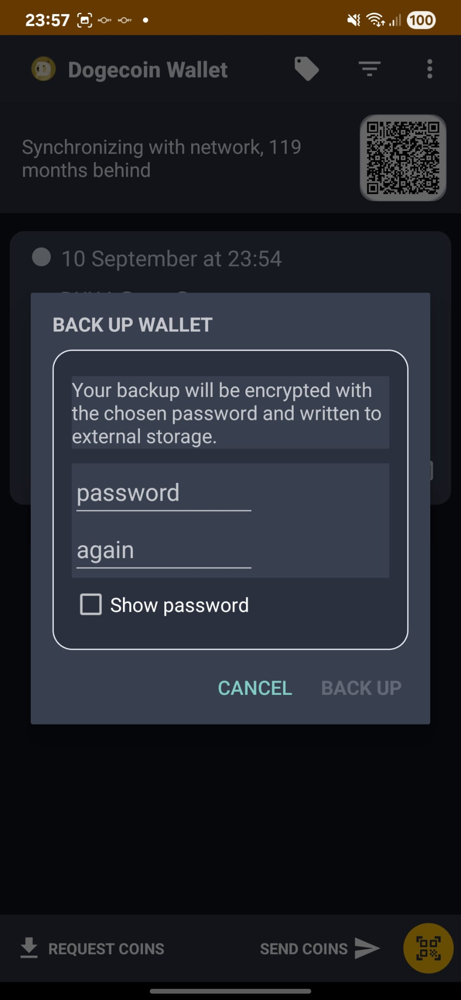
  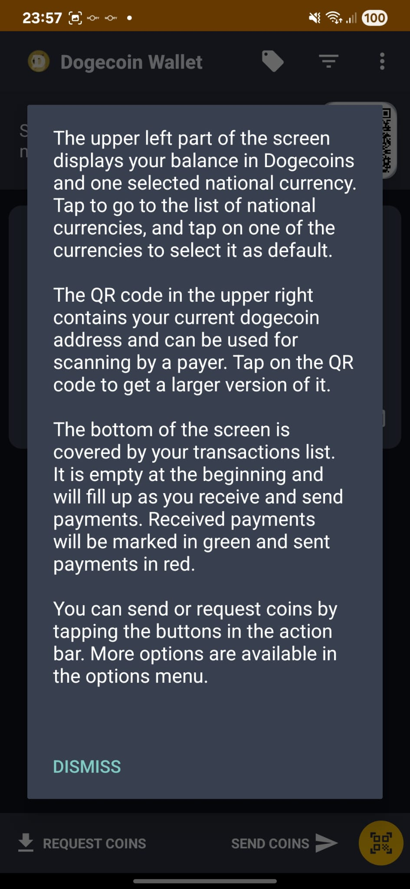
</div>


This project contains several sub-projects:

 * __wallet__:
     The Android app itself. This is probably what you're searching for.
 * __market__:
     App description and promo material for the Google Play app store.
 * __integration-android__:
     A tiny library for integrating Dogecoin payments into your own Android app
     (e.g. donations, in-app purchases).
 * __sample-integration-android__:
     A minimal example app to demonstrate integration of Dogecoin payments into
     your Android app.

## 🚀 RECENT CHANGES - BITCOIN TO DOGECOIN CONVERSION

This wallet has been completely converted from Bitcoin to Dogecoin. Here are the major changes made:

## ✨ NEW FEATURES & IMPROVEMENTS

### 🔍 Advanced QR Code Scanner
- **Upgraded to Google ML Kit**: Replaced ZXing with Google ML Kit Barcode Scanning for superior QR code detection
- **Modern QR Code Support**: Can read aesthetic QR codes with bullet points, custom shapes, and non-standard designs
- **Better Accuracy**: Machine learning-based detection provides higher success rates
- **Compatibility**: Maintains support for traditional square QR codes

### 🔋 Battery Optimization Fix
- **Fixed Background Sync Issues**: Resolved problems with header synchronization being interrupted by Android's battery optimization
- **New Permission**: Added `REQUEST_IGNORE_BATTERY_OPTIMIZATIONS` permission
- **Settings Integration**: Added battery optimization preference in app settings
- **Reliable Sync**: Headers now sync consistently without being put to sleep

### 🌐 Worldwide Node Discovery
- **New Total Nodes Tab**: Added comprehensive network monitoring in the Network Monitor
- **Real-time Discovery**: Continuously discovers Dogecoin nodes worldwide every 5 seconds
- **Detailed Information**: Shows node version, sub-version, services, synced blocks, and connection status
- **Health Monitoring**: Automatically removes inactive nodes and finds replacements every 10 minutes
- **IPv6 & TOR Support**: Discovers nodes across different network types
- **Live Updates**: Real-time display of discovered nodes with progress indicators

### 📝 Digital Document Signing
- **Document & Message Signing**: Sign any text, document, or message with your Dogecoin private key
- **File Hash Generation**: Automatically generates SHA256 hash for file verification
- **Camera Integration**: Take photos and sign them directly from the camera
- **Easy Sharing**: Share signed documents and signatures via any Android sharing method
- **Signature Verification**: Verify signatures against original text or file hashes
- **Secure Storage**: Signed photos are stored in a dedicated "signed" folder
- **Multiple Formats**: Support for text messages, file hashes, and photo signatures

### 💳 Recurring Payments & Scheduled Transactions
- **One-Time & Recurring Payments**: Schedule payments for specific dates or recurring monthly
- **Precise Scheduling**: Set exact date and time for payment execution
- **Reference Field**: Add custom reference data (OP_RETURN) for bill payments, client IDs, or service identification
- **Address Book Integration**: Select from existing addresses or add new labeled addresses
- **Background Execution**: Automatic payment processing via background service
- **Enable/Disable Control**: Toggle recurring payments on/off as needed
- **Edit & Manage**: Full CRUD operations for scheduled payments
- **Blockchain Storage**: Reference data is permanently stored on the Dogecoin blockchain
- **Real-Time Monitoring**: Live status updates and payment history

### Core Network Changes
- **Network Parameters**: Switched from Bitcoin mainnet/testnet to Dogecoin mainnet using `DogecoinMainNetParams`
- **Library Migration**: Replaced `bitcoinj` with `libdohj` (DogecoinJ library) version 0.15
- **Application ID**: Changed from `de.schildbach.wallet` to `org.dogecoin.wallet`
- **Network Constants**: Updated all network-specific constants for Dogecoin

### UI and Branding Updates
- **App Name**: Changed from "Bitcoin Wallet" to "Dogecoin Wallet"
- **Currency Symbol**: Updated from BTC to DOGE throughout the interface
- **Color Scheme**: Implemented Dogecoin-themed amber/yellow color scheme:
  - Primary color: `#ffc107` (amber)
  - Primary dark: `#ff8f00` (darker amber)
  - Accent color: `#ffc107` (amber)
- **App Icon**: Updated to Dogecoin-themed iconography
- **String Resources**: All user-facing text converted from Bitcoin to Dogecoin terminology

### Technical Implementation
- **MIME Types**: Updated to Dogecoin-specific MIME types:
  - `application/x-dogetx` for transactions
  - `application/x-dogecoin-wallet-backup` for wallet backups
- **URL Schemes**: Added support for `dogecoin:` and `DOGECOIN:` URL schemes
- **BIP-21 Support**: Implemented BIP-21 URI scheme support for QR code payments
- **Block Explorer**: Configured to use SoChain for Dogecoin blockchain exploration
- **API Integration**: Updated to use Dogecoin-specific APIs and endpoints

### Build Configuration Updates
- **Gradle**: Updated to Android Gradle Plugin 8.12.2
- **Target SDK**: Updated to Android API 34
- **Dependencies**: Updated all AndroidX libraries to latest compatible versions
- **NDK**: Temporarily disabled for testing (can be re-enabled if needed)
- **Product Flavors**: Simplified build configuration

### Asset Updates
- **Checkpoints**: Updated with Dogecoin blockchain checkpoints
- **Electrum Servers**: Configured Dogecoin Electrum servers
- **Fee Structure**: Updated to follow official Dogecoin fee recommendations (0.01 DOGE per KB)
- **Word Lists**: Updated BIP39 wordlist for Dogecoin compatibility

### Security and Privacy
- **Report Email**: Updated to `dogecoinandroid@gmail.com`
- **Source URLs**: Updated to point to Dogecoin wallet repository
- **User Agent**: Changed to "Dogecoin Wallet"
- **Network Security**: Maintained all original security features

### Digital Signing Implementation
- **Cryptographic Signing**: Uses ECDSA with secp256k1 curve for document authentication
- **SHA256 Hashing**: Secure file hash generation for integrity verification
- **Private Key Security**: Signing uses wallet's private keys without exposing them
- **File Provider**: Secure file sharing for camera-captured photos
- **Signature Format**: Base64-encoded signatures for easy sharing and verification

### Recurring Payments Implementation
- **SQLite Database**: Local storage for payment schedules and configuration
- **JobScheduler**: Android JobScheduler for reliable background execution
- **OP_RETURN Support**: Custom reference data stored on Dogecoin blockchain
- **Address Book Integration**: Room database for managing payment destinations
- **Context Management**: Proper BitcoinJ context initialization for transaction execution
- **Error Handling**: Comprehensive error handling and logging for payment failures

## 📱 FEATURES

• **Decentralized**: No registration, web service or cloud needed! This wallet is peer-to-peer.
• **Multi-Unit Display**: Display of Dogecoin amount in DOGE, mDOGE and µDOGE.
• **Currency Conversion**: Real-time conversion to and from national currencies.
• **Multiple Payment Methods**: Send and receive Dogecoin via NFC, QR codes, or Dogecoin URLs.
• **Offline Payments**: When you're offline, you can still pay via Bluetooth.
• **Notifications**: System notification for received coins.
• **Paper Wallet Support**: Sweeping of paper wallets (e.g. those used for cold storage).
• **Android Widget**: Home screen widget to easily view your Dogecoin balance and quickly access send/receive functions without opening the app.
• **Low Fees**: Uses official Dogecoin fee recommendations (0.01 DOGE per KB) for affordable transactions.
• **Security**: Supports SegWit and modern address formats.
• **Privacy**: Supports Tor via the separate Orbot app.

### 🆕 NEW ADVANCED FEATURES

• **📝 Digital Document Signing**: Sign any text, document, or photo with your Dogecoin private key for authentication and verification.
• **💳 Recurring Payments**: Schedule one-time or monthly recurring payments with precise date/time control.
• **🏷️ Reference Data**: Add custom reference information (OP_RETURN) to payments for bill identification, client IDs, or service tracking.
• **📸 Camera Integration**: Take photos and sign them directly from the camera for document authentication.
• **🔄 Background Processing**: Automatic execution of scheduled payments via background service.
• **📋 Address Management**: Integrated address book for easy payment destination selection.
• **✅ Signature Verification**: Verify document signatures against original content for authenticity.
• **🌐 Blockchain Storage**: Reference data is permanently stored on the Dogecoin blockchain for decentralized verification.

## 💰 TRANSACTION FEES

This wallet follows the official Dogecoin fee recommendations for optimal network performance and user experience:

### **Fee Structure**
- **All Categories**: 0.01 DOGE per kilobyte (KB) of transaction data
- **Fee Categories**: ECONOMIC, NORMAL, and PRIORITY all use the same rate
- **Static Fees**: No dynamic fee fetching - uses consistent, predictable fees

### **Real-World Examples**
- **Small transaction** (~250 bytes): ~0.0025 DOGE
- **Medium transaction** (~500 bytes): ~0.005 DOGE  
- **Large transaction** (~1000 bytes): ~0.01 DOGE

### **Benefits**
- **Affordable**: Much lower than Bitcoin fees, making micro-transactions practical
- **Predictable**: Same fee rate across all transaction types
- **Official Standards**: Follows [Dogecoin Core recommendations](https://github.com/dogecoin/dogecoin/blob/master/doc/fee-recommendation.md)

## 🛠️ PREREQUISITES FOR BUILDING

### System Requirements
- **Operating System**: Windows 10/11, macOS, or Linux
- **Java**: Java 8 SDK or later (OpenJDK recommended)
- **Android Studio**: Version 2023.1.1 or later
- **Android SDK**: API Level 34 (Android 14)
- **Gradle**: 8.12.2 (included with Android Studio)

### Required Tools
- Git (for version control)
- Android Studio (for development and building)
- Android SDK Tools
- Java Development Kit (JDK 8 or later)

## 🏗️ BUILDING WITH ANDROID STUDIO

### 1. Initial Setup

1. **Clone the repository**:
   ```bash
   git clone https://github.com/qlpqlp/dogecoin-wallet.git
   cd dogecoin-wallet
   ```

2. **Open in Android Studio**:
   - Launch Android Studio
   - Select "Open an existing Android Studio project"
   - Navigate to the cloned repository folder
   - Click "OK"

3. **Configure Android SDK**:
   - Go to `File` → `Project Structure` → `SDK Location`
   - Ensure Android SDK is properly configured
   - Verify that API Level 34 is installed

### 2. Project Configuration

1. **Sync Project**:
   - Android Studio will automatically detect the Gradle project
   - Click "Sync Now" when prompted
   - Wait for the sync to complete

2. **Configure Signing** (for release builds):
   - Go to `Build` → `Generate Signed Bundle/APK`
   - Create a new keystore or use existing one
   - Configure signing for release builds

### 3. Building the Application

#### Debug Build
1. **Select Build Variant**:
   - In Android Studio, go to `Build` → `Select Build Variant`
   - Choose `debug` variant

2. **Build APK**:
   - Go to `Build` → `Build Bundle(s) / APK(s)` → `Build APK(s)`
   - Wait for build to complete
   - APK will be generated in `wallet/build/outputs/apk/debug/`

#### Release Build
1. **Select Build Variant**:
   - Choose `release` variant from Build Variants panel

2. **Generate Signed APK**:
   - Go to `Build` → `Generate Signed Bundle/APK`
   - Select APK and click Next
   - Choose your keystore and configure signing
   - Click Finish

### 4. Running on Device/Emulator

1. **Connect Device**:
   - Enable Developer Options on your Android device
   - Enable USB Debugging
   - Connect device via USB

2. **Run Application**:
   - Click the "Run" button (green play icon) in Android Studio
   - Select your connected device or emulator
   - The app will be installed and launched

### 5. Troubleshooting Common Issues

#### Build Errors
- **Gradle Sync Issues**: Clean and rebuild project (`Build` → `Clean Project`, then `Build` → `Rebuild Project`)
- **SDK Issues**: Ensure Android SDK is properly installed and configured
- **Dependency Issues**: Check that all dependencies are properly resolved

#### Runtime Issues
- **Permission Issues**: Ensure all required permissions are granted
- **Network Issues**: Check internet connectivity for blockchain sync
- **Storage Issues**: Ensure sufficient storage space for blockchain data

## 🔧 ADVANCED BUILD CONFIGURATION

### Gradle Properties
The project uses the following key Gradle properties:
```properties
org.gradle.jvmargs=-Xmx4096M
android.useAndroidX=true
android.enableJetifier=true
android.suppressUnsupportedCompileSdk=34
android.nonTransitiveRClass=false
android.defaults.buildfeatures.buildconfig=true
android.nonFinalResIds=false
android.enableR8.fullMode=false
```

### Build Variants
- **Debug**: Development build with debugging enabled
- **Release**: Production build optimized for distribution

### Dependencies
Key dependencies include:
- `libdohj:0.15` - DogecoinJ library
- `androidx.*` - AndroidX libraries
- `com.google.mlkit:barcode-scanning:17.2.0` - Advanced QR code scanning with ML Kit
- `com.google.zxing:core:3.5.3` - Legacy QR code support (kept for compatibility)
- `com.squareup.okhttp3:okhttp:3.14.9` - HTTP client

## 📦 DISTRIBUTION

### APK Signing
For distribution, you must sign your APK:
1. Generate a keystore file
2. Configure signing in `build.gradle`
3. Build signed APK for distribution

### Google Play Store
To publish on Google Play:
1. Create a Google Play Console account
2. Prepare store listing materials
3. Upload signed APK or AAB
4. Complete store listing and publish

## 🤝 CONTRIBUTING

This project is open source and welcomes contributions:

1. Fork the repository
2. Create a feature branch
3. Make your changes
4. Test thoroughly
5. Submit a pull request

## 📄 LICENSE

This project is licensed under the GNU General Public License v3.0 (GPLv3).
See the [LICENSE](LICENSE) file for details.

## ⚠️ DISCLAIMER

**Use at your own risk!** This software is provided as-is without any warranty. 
Always backup your wallet and test with small amounts before using for significant transactions.

## 📞 SUPPORT

For issues and support:
- **Email**: report@inevitable360.com
- **GitHub Issues**: [Create an issue](https://github.com/qlpqlp/dogecoin-wallet/issues)
- **Documentation**: Check the [wiki](https://github.com/qlpqlp/dogecoin-wallet/wiki)

## 🙏 CREDITS

- **Original Bitcoin Wallet**: Andreas Schildbach
- **Dogecoin Wallet Conversion**: Langer Hans [@langer_hans](https://x.com/langer_hans)
- **Additional Contributors**: inevitable360 [@inevitable360](https://x.com/inevitable360) and other contributors
- **DogecoinJ Library**: [libdohj](https://github.com/dogecoin/libdohj)
- **Google ML Kit**: Advanced QR code scanning with machine learning
- **ZXing**: Legacy QR code scanning library (kept for compatibility)
- **AndroidX**: Modern Android libraries
- **OkHttp**: HTTP client library

---

**Hope you like it. Happy Dogecoin transactions!**